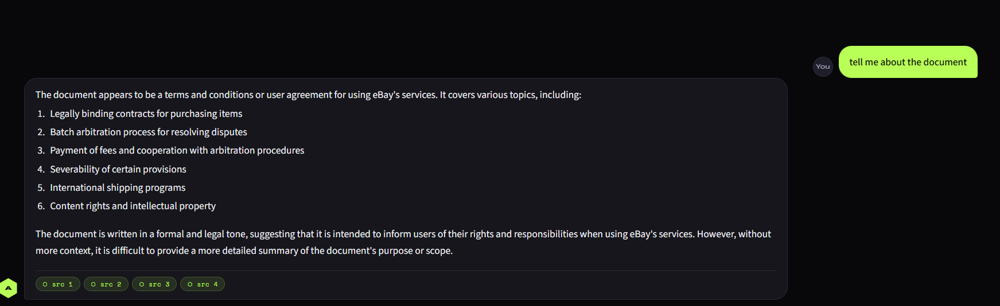
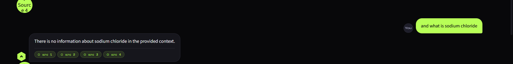

# ◈ Amlgo Labs — RAG Chatbot with Streaming Responses

> A production-ready document Q&A chatbot built with LangChain, Pinecone, Sentence Transformers, and Streamlit.  
> Users just ask questions — all indexing is done beforehand.

🔗 **GitHub Repository:** [https://github.com/vivekkumar1522/amlgo-labs-chatbot](https://github.com/vivekkumar1522/amlgo-labs-chatbot)

---

## Demo Screenshots

**Success case — document summary query:**



**Limitation case — out-of-scope query correctly refused:**



---

## Architecture Overview

```
┌─────────────────────────────────────────────────────────────┐
│                         User Interface                       │
│                    Streamlit (app.py)                        │
└───────────────────────────┬─────────────────────────────────┘
                            │ query
                            ▼
┌─────────────────────────────────────────────────────────────┐
│                      RAG Pipeline                            │
│                    src/pipeline.py                           │
│                                                              │
│   ┌──────────────────┐       ┌──────────────────────────┐   │
│   │    Retriever      │       │       Generator           │   │
│   │  src/retriever.py │       │    src/generator.py       │   │
│   │                  │       │                           │   │
│   │  HuggingFace     │       │  Groq API (LLaMA 3.3-70B) │   │
│   │  Embeddings      │       │  Streaming token output   │   │
│   │  (MiniLM-L6-v2)  │       │                           │   │
│   └────────┬─────────┘       └───────────────────────────┘   │
│            │                                                  │
│            ▼                                                  │
│   ┌──────────────────┐                                        │
│   │   Pinecone DB    │                                        │
│   │  amlgo-index     │                                        │
│   │  Vector Search   │                                        │
│   └──────────────────┘                                        │
└─────────────────────────────────────────────────────────────┘
```

**Flow:**
1. Query → Embedding (MiniLM) → Pinecone similarity search → Top-4 chunks
2. Chunks + Query → Prompt → Groq LLaMA 3.3-70B → Streamed answer

---

## Folder Structure

```
amlgo-labs-chatbot/
├── app.py                  # Streamlit UI with streaming
├── requirements.txt
├── .env.example            # Copy to .env and fill in your keys
├── README.md
│
├── data/                   # ← Drop your PDF/TXT files here
│   └── ebay_user_agreement.pdf
│
├── src/
│   ├── __init__.py
│   ├── ingest.py           # One-time indexing script
│   ├── retriever.py        # Pinecone + embeddings
│   ├── generator.py        # Groq LLM + streaming
│   └── pipeline.py         # Combines retriever + generator
│
├── screenshots/            # Demo screenshots
│   ├── screenshot1.png
│   └── screenshot2.png
├── chunks/                 # (optional) saved chunk previews
├── vectordb/               # (optional) local cache
└── notebooks/              # Exploration notebooks
```

---

## Setup Instructions

### 1. Clone and install dependencies

```bash
git clone https://github.com/vivekkumar1522/amlgo-labs-chatbot.git
cd amlgo-labs-chatbot
pip install -r requirements.txt
```

### 2. Get your free API keys

| Service | URL | What it's for |
|---------|-----|---------------|
| **Pinecone** | [app.pinecone.io](https://app.pinecone.io) | Vector database (free tier: 1 index) |
| **Groq** | [console.groq.com](https://console.groq.com) | Free LLM API (LLaMA 3.3, Mistral) |

### 3. Configure environment variables

Create a `.env` file in the project root — **no trailing spaces anywhere**:

```env
PINECONE_API_KEY=your_pinecone_api_key_here
PINECONE_INDEX=amlgo-index

GROQ_API_KEY=your_groq_api_key_here
LLM_MODEL=llama-3.3-70b-versatile

EMBEDDING_MODEL=sentence-transformers/all-MiniLM-L6-v2
LLM_TEMPERATURE=0.2
LLM_MAX_TOKENS=512
```

> ⚠️ **Important:** Never commit your real `.env` to GitHub. It contains private API keys. The `.gitignore` already excludes it.

### 4. Add your document(s)

```bash
# Drop your PDF or TXT files into the /data folder
cp your_document.pdf data/
```

### 5. Run the ingestion pipeline (ONE TIME ONLY)

```bash
python -m src.ingest
```

This will:
- Load all PDF/TXT files from `/data`
- Clean and chunk them into ~200–300 word segments
- Generate embeddings using `all-MiniLM-L6-v2`
- Create the Pinecone index (`amlgo-index`) automatically if it doesn't exist
- Wait for the index to be ready before upserting
- Upsert all vectors to Pinecone

Expected output:
```
🚀  Amlgo — Document Ingestion Pipeline
=============================================
📂  Loading documents from: ./data
✅  Loaded 42 raw pages/documents.
✅  Created 187 chunks.
🔧  Creating Pinecone index 'amlgo-index'…
⏳  Waiting for index to be ready…
✅  Index created and ready.
🔢  Loading embedding model…
⬆️   Upserting 187 chunks to Pinecone…
✅  All chunks indexed successfully.
🎉  Ingestion complete! You can now run: streamlit run app.py
```

> ⚠️ **Always run ingest before starting the app.** The app will throw a `404 Not Found` error if the Pinecone index doesn't exist yet.

### 6. Run the chatbot

```bash
streamlit run app.py
```

Open [http://localhost:8501](http://localhost:8501) in your browser.

---

## Model & Embedding Choices

### Embedding Model: `all-MiniLM-L6-v2`
- Lightweight (~80 MB), runs entirely on CPU — no GPU required
- 384-dimensional dense vectors
- Strong retrieval quality for English legal and policy documents
- From the `sentence-transformers` library (HuggingFace)

### LLM: `llama-3.3-70b-versatile` via Groq
- Free tier available on Groq
- Near-instant inference via Groq's LPU hardware with streaming support
- Temperature: 0.2 — low, for factual and grounded answers
- Max tokens: 512
- Context window: 8192 tokens

### Vector DB: Pinecone Serverless (`amlgo-index`)
- Free tier: 1 index, up to 100K vectors
- Cosine similarity search
- Fully managed — no infrastructure setup needed
- Top-4 most relevant chunks retrieved per query

---

## Sample Queries & Outputs

**Query 1:** *"Tell me about the document"*  
✅ Correctly identifies the eBay User Agreement and summarises its 6 main topic areas with source citations.

**Query 2:** *"What are the main privacy rights of users?"*  
✅ Returns accurate answer citing specific clauses from the document.

**Query 3:** *"What happens during the batch arbitration process?"*  
✅ Retrieves relevant arbitration sections and streams a grounded, detailed answer with source passages.

**Query 4 (Failure case):** *"What is sodium chloride?"*  
⚠️ Model correctly responds: "There is no information about sodium chloride in the provided context."

**Query 5 (Ambiguous):** *"Tell me everything"*  
⚠️ Model provides a high-level summary and asks the user for a more specific question.

---

## Known Limitations

- **Hallucination risk:** The model is prompted to stay grounded (temperature 0.2), but may occasionally infer beyond the retrieved context on ambiguous queries.
- **Chunk boundary issues:** Answers may be incomplete if relevant information spans a chunk boundary. Mitigated by 50-word overlap between chunks.
- **CPU-only embeddings:** Embedding 187 chunks takes ~10 seconds on first run; all subsequent queries are fast (< 100 ms).
- **Groq rate limits:** Free tier has rate limits (~30 req/min); add retry logic with exponential back-off for production use.
- **Index name sensitivity:** Trailing spaces or mismatched names between `.env` and source files cause a `404 Not Found` on startup. Always ensure the index name is consistent and trimmed.

---

## Tech Stack

| Component | Library / Service |
|-----------|------------------|
| Framework | LangChain |
| Embeddings | sentence-transformers — `all-MiniLM-L6-v2` (HuggingFace) |
| Vector DB | Pinecone Serverless (`amlgo-index`) |
| LLM | LLaMA 3.3-70B via Groq API |
| UI | Streamlit |
| Doc Loading | LangChain DirectoryLoader + PyPDF |
| Environment | python-dotenv |
